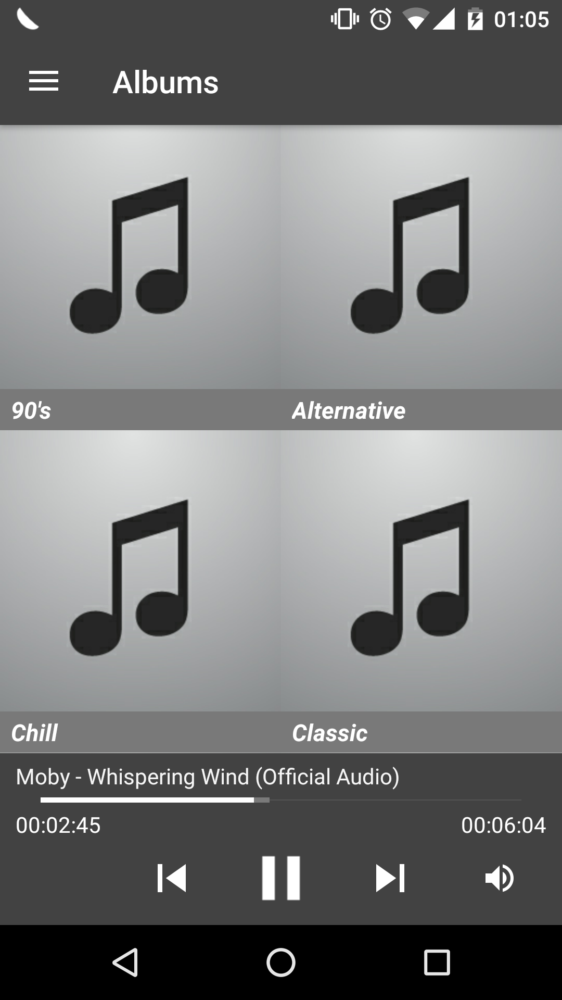
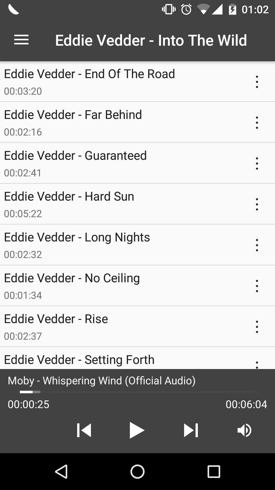
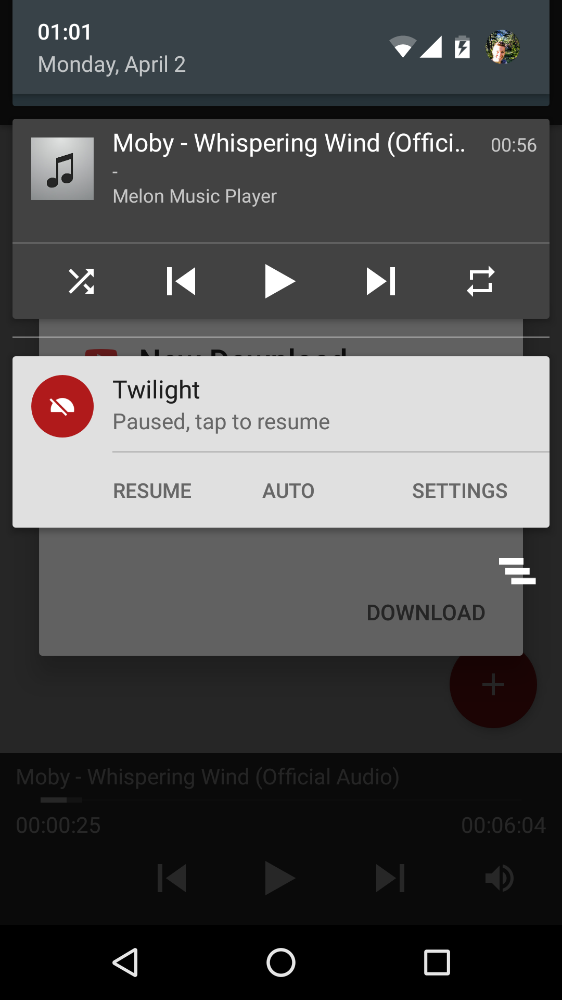
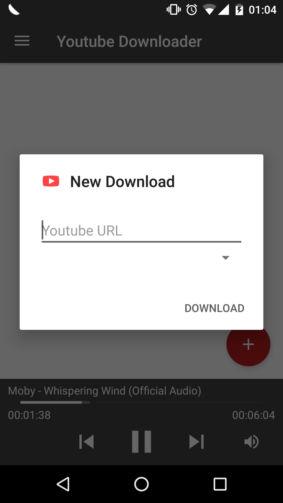

# Android Melon Music Player Client

## Impression

The album list:

The song list:

Media notification for playback:

Youtube download:

## TODO

- [ ] Able to send an MRL link to server to download
- [ ] Retrieve album covers from the server
- [ ] Able to sync media files with clients/controllers
- [ ] SoundCloud & Mixcloud searching support
- [ ] Able to select radio stations
- [x] gRPC implementation
- [x] Handle all MusicPlayer RPC calls (play, pause, ...)
- [x] Retrieve album & song list
- [x] Volume control
- [x] Queue music (next & previous song selection)
- [ ] Write tests